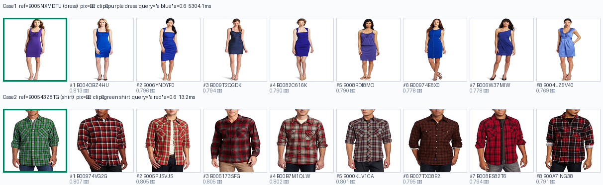

# 演示案例说明（组合图像检索 CIR 交互 Demo）

本 Demo 演示的是课程框架的 **Stage-1 检索**环节：给一张**参考图** + 一条**修改指令**，
用 CLIP 在图像库中检索出「修改后最接近」的图像。此处用纯 CLIP 融合查询做轻量复现，
**秒级返回**，界面直观，适合课上演示。

## 启动

WSL2 里 `conda activate project_env; cd src/demo_fiq; python -m uvicorn server:app --host 0.0.0.0 --port 8899`，
浏览器打开 `http://127.0.0.1:8899`。

前端有两个 **「推荐案例」按钮**，一键复现下面的演示。

## 数据

图库是 **真实 FashionIQ val 服装商品图**（`data/FashionIQ_real/images`），共 **15536 张**，
三分类：dress 连衣裙 3817 / shirt 衬衫 6346 / toptee 上衣 5373。
左侧网格只展示部分、可「加载更多」，但**检索在全库进行**；每张图都已离线用 laion ViT-B/32
预计算好 512 维向量（`data/FashionIQ_real/clip_db`），因此每次请求只需实时编码 1 条英文文本。

下表里每个候选图给出两个客观标签：**主色**（像素级 HSV 判色，取中央区强饱和像素）与
**CLIP 近邻标签**（“颜色+款式”文本描述）——两者都只看图本身，不依赖本次检索的相似度。

## 机制一句话

`查询向量 = 参考图向量 + α × 指令文本向量`（都做 L2 归一化），再与全库 15536 个向量算余弦
相似度排序，并**排除参考图本身**。α 越大越「像参考图」，越小越「听指令」。

---

## 案例 1：把紫色连衣裙改成蓝色

- **参考图**：`B005NXMDTU`（dress）· 主色 = 紫 · CLIP 标签 ≈ purple dress
- **中文指令**：把紫色改成蓝色
- **英文 CLIP 查询**：`"a blue"`　 α = 0.6

实测结果（相似度降序，前 8 名）：

| 排名 | 图像 | 相似度 | 主色 | CLIP 标签 |
|---|---|---|---|---|
| 1 | B004OBZ4HU | 0.813 | 蓝 | blue dress |
| 2 | B006YNDYF0 | 0.796 | 蓝 | blue dress |
| 3 | B009T2QGDK | 0.794 | 蓝 | blue dress |
| 4 | B0082C616K | 0.790 | 蓝 | blue dress |
| 5 | B008RDI8MO | 0.790 | 蓝 | purple dress |
| 6 | B00974E8X0 | 0.778 | 蓝 | blue dress |
| 7 | B006W37MIW | 0.778 | 蓝 | blue dress |
| 8 | B004LZ5V40 | 0.769 | 蓝 | blue dress |

→ **前 8 名主色全部变为蓝**，7/8 的 CLIP 标签为 blue dress——参考图是紫裙子，检索出的都是
“蓝色裙子”，改色方向干净成立。

## 案例 2：把绿色衬衫改成红色

- **参考图**：`B00543Z8TG`（shirt）· 主色 = 绿 · CLIP 标签 ≈ green shirt
- **中文指令**：把绿色改成红色
- **英文 CLIP 查询**：`"a red"`　 α = 0.6

实测结果：

| 排名 | 图像 | 相似度 | 主色 | CLIP 标签 |
|---|---|---|---|---|
| 1 | B00974VG2G | 0.807 | 红 | red shirt |
| 2 | B005PJSVJS | 0.805 | 红 | red shirt |
| 3 | B005173SFG | 0.805 | 红 | red shirt |
| 4 | B00B7M1QLW | 0.802 | 红 | red shirt |
| 5 | B000KLV1CA | 0.802 | 红 | red shirt |
| 6 | B007TXC8E2 | 0.795 | 红 | red shirt |
| 7 | B008ES82T6 | 0.794 | 红 | red shirt |
| 8 | B00A7ING38 | 0.791 | 红 | red shirt |

→ **前 8 名主色与 CLIP 标签全部为红衬衫**——绿衬衫经指令后检索出的全是红衬衫，行为非常整齐。

**拼图**（每行 = 绿框参考图 + 按序 top-8 检索结果）：

## 怎么读这个结果

- **看名次靠前的图**：它们是「既像参考图、又带上目标色」的候选——这正是组合检索想要的行为
  （不是纯文本搜图，也不是纯图像找相似，而是**两者融合**）。注意结果里保留了大量「与参考图同款型/
  同姿态」的信息，只是颜色切换了。
- **看相似度**：在 1.5 万张真图池里，两例 top-1 都 ≥ 0.81，且前 8 名全部命中目标色——区分度和
  可信度都远高于小占位图库。
- **换 α 试试**：α 调小 → 结果更由指令主导；α 调大 → 结果更由参考图主导。这是 CIR 方法的经典旋钮。
- **点结果图**：任一结果图可直接设为新参考图继续检索，可展示“逐级改款”的多轮交互。
